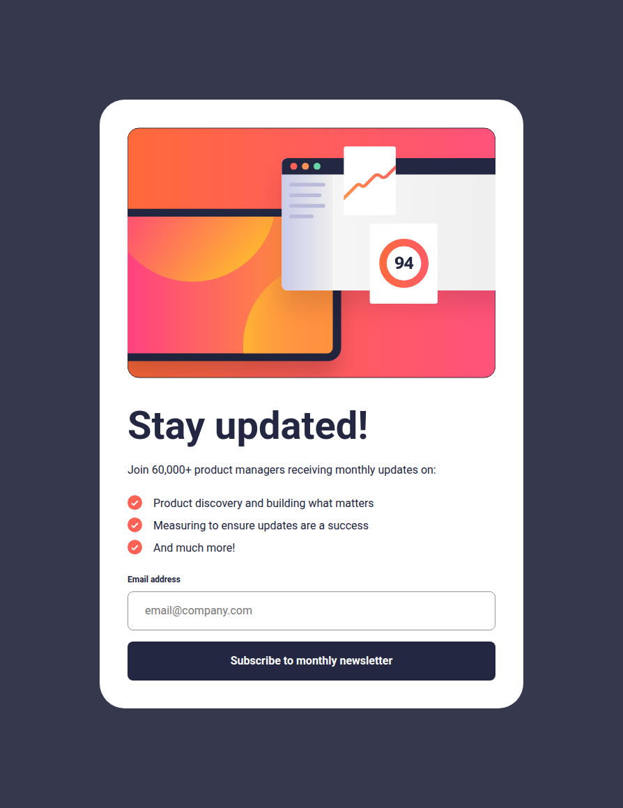

# Frontend Mentor - Newsletter sign-up form with success message solution

This is a solution to the [Newsletter sign-up form with success message on Frontend Mentor](https://www.frontendmentor.io/challenges/newsletter-signup-form-with-success-message-3FC1AZbNrv).
Frontend Mentor challenges help improve frontend skills by building realistic UI components.

## Table of contents

- [Overview](#overview)
  - [Preview](#preview)
  - [Links](#links)
- [Features](#features)
- [My process](#my-process)
  - [Built with](#built-with)
  - [What I learned](#what-i-learned)
- [Setup](#setup)
  - [Installation](#installation)
  - [Development](#development)
  - [Build](#build)
  - [Linting](#linting)
- [Deployment](#deployment)
- [Performance](#performance)
- [Continued Development](#continued-development)
- [Useful Resources](#useful-resources)
- [AI Collaboration](#ai-collaboration)
- [Author](#author)
- [Notes](#notes)

## Overview

### The challenge

Users should be able to:

- Add their email and submit the form
- See a success message with their email after successfully submitting the form
- See form validation messages if:
  - The field is left empty
  - The email address is not formatted correctly
- View the optimal layout for the interface depending on their device's screen size
- See hover and focus states for all interactive elements on the page

### Preview

<details>
  <summary>Click to expand website preview</summary>
  <br>
  <p align="center">
    
  </p>
</details>

### Links

- Solution URL: [GitHub Repo](https://github.com/vlrnsnk/newsletter-sign-up-with-success-message)
- Live Site URL: [Live Site](https://vlrnsnk.github.io/newsletter-sign-up-with-success-message/)

## Features

- Responsive mobile-first layout (mobile, tablet, desktop)
- Email validation with inline error states
- Cross-fade transition between form and success state
- Accessible interactive states (`:hover`, `:focus-visible`)
- Semantic HTML with ARIA error messaging
- Modular SCSS architecture (`@use`/`@forward`)
- CSS custom properties for design tokens
- Stylelint with property ordering rules
- Vite build pipeline
- Sharp image optimization (WebP + AVIF)
- GitHub Pages deployment via GitHub Actions

## My process

### Built with

- Semantic HTML5
- SCSS (7-1 pattern: abstracts, vendors, base, layout, components, pages, themes)
- CSS custom properties + SCSS variables
- Flexbox and CSS Grid
- Mobile-first responsive workflow
- Vite 8
- Sharp (image optimization)
- Stylelint (config-standard-scss + property order)
- HTML validate
- Husky + lint-staged

### What I learned

- CSS Grid overlay pattern (`grid-area: 1/1`) for cross-fading sibling components without absolute positioning
- `<picture>` source ordering for art direction across breakpoints vs resolution switching
- Token-based breakpoint system via SCSS variables mapped to mixins
- That Figma specs can be off by 4-8px and chasing pixel perfection wastes time
- That `<picture>` (not ``) is the flex item when reordering with `order`

## Setup

### Installation

```bash
npm install
```

### Development

```bash
npm run dev
```

### Build

```bash
npm run build
npm run preview
```

### Linting

```bash
npm run lint:scss
npm run lint:html
```

This project uses Stylelint + EditorConfig + Husky pre-commit hooks
to ensure consistent code formatting before commits.

### Fix linting issues:

```bash
npm run lint:scss:fix
npm run lint:html:fix
```

## Deployment

Project is built with Vite and deployed to GitHub Pages using GitHub Actions.

## Performance

Lighthouse score:

- Performance: 100
- Accessibility: 95
- Best Practices: 100
- SEO: 100

Accessibility score was reduced due to insufficient color contrast in the provided design palette.

## Continued Development

- Add unit tests for form validation logic
- Implement actual form submission (currently no backend)
- Improve color contrast (Lighthouse flagged the design palette)

## Useful Resources

- [CSS Grid overlay technique](https://css-tricks.com/snippets/css/complete-guide-grid/) - for the cross-fade between sign-up and success states
- [Modern CSS reset](https://www.joshwcomeau.com/css/custom-css-reset/) - base reset patterns
- [Stylelint SCSS config](https://github.com/stylelint-scss/stylelint-config-standard-scss) - property ordering for SCSS
- [Frontend Mentor challenge](https://www.frontendmentor.io/challenges/newsletter-signup-form-with-success-message-3FC1AZbNrv) - original design and spec

## AI Collaboration

Used Claude (Sonnet 4.5 / Opus 5) via Claude Code as a pair-programming partner throughout the project.

**What it helped with:**

- Debugging CSS layout issues (centering, grid overlay, `<picture>` reordering)
- Refactoring SCSS architecture decisions
- Sanity-checking pixel-perfect design mismatches (saved hours of chasing figma bugs)
- README structure and project documentation

**What didn't work:**

- Initial overengineered suggestions (animating transitions on absolute-positioned elements when grid overlay was simpler)
- Assumptions about what design was showing without me sharing the image

**Takeaway:** AI is fastest when you already know what you want — it accelerates decisions, doesn't make them.

## Author

- Website: https://vlrnsnk.com
- Frontend Mentor: https://www.frontendmentor.io/profile/vlrnsnk
- GitHub: https://github.com/vlrnsnk

## Notes

- No backend — form submission is client-side only and shows success state immediately
- Email regex follows the HTML5 living standard (more permissive than naive `[a-z]+@[a-z]+`)
- `prefers-reduced-motion: reduce` is handled globally in `_utilities.scss` — disables all transitions
- All images are SVGs (vector), so no WebP/AVIF variants are generated for this project
- `font-size: 100%` on root with `rem` units = 1rem = 16px (browser default)
